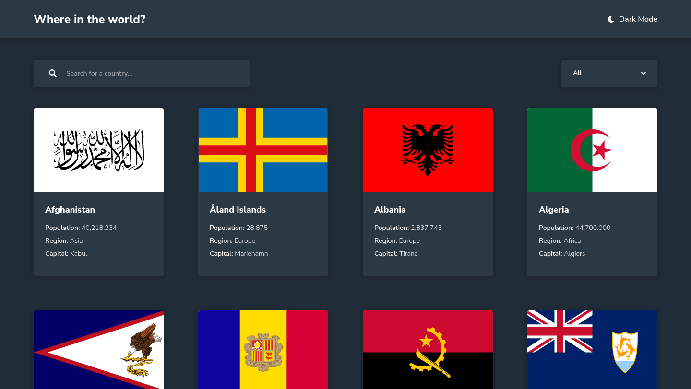

# 🌍 Countries App

[](https://github.com/grazziotti/rest-countries-api/blob/main/LICENSE)



## 📄 Descrição

Este projeto é uma solução para o desafio [REST Countries API](https://www.frontendmentor.io/challenges/rest-countries-api-with-color-theme-switcher-5cacc469fec04111f7b848ca) do site [Frontend Mentor](https://www.frontendmentor.io/). Os desafios do Frontend Mentor ajudam a melhorar suas habilidades de codificação ao construir projetos realistas.

O Countries App é um aplicativo web que fornece informações sobre diferentes países ao redor do mundo. Ele utiliza a API Rest Countries para buscar dados e exibir vários detalhes sobre cada país, incluindo seu nome, capital, população, idiomas, moedas etc...

## 🔗 Links

- Solução: [aqui](https://www.frontendmentor.io/solutions/rest-countries-api-react-typescript-flexbox-and-grid-XyGdM-RX26)
- Link do projeto: [aqui](https://rest-countries-api-grazziotti.vercel.app/)

## 🛠 Tecnologias Utilizadas

- [React](https://reactjs.org/)
- [TypeScript](https://www.typescriptlang.org/)
- [Styled Components](https://styled-components.com/)
- [React Router](https://reactrouter.com/)
- [Axios](https://axios-http.com/)
- [Rest Countries API](https://restcountries.com/)
- [Context API](https://pt-br.legacy.reactjs.org/docs/context.html)

## ✨ Funcionalidades

- [x] Theme Switcher
- [x] O tema é mantido
- [x] Consumo da API de países
- [x] Visualizar informações detalhadas sobre um país específico
- [x] Pesquisar países pelo nome
- [x] Filtrar países por região
- [x] Tratativa de erros

## 📋 Pré-requisitos

Antes de começar, você vai precisar ter instalado em sua máquina as seguintes ferramentas: [Git](https://git-scm.com/), [Node.js](https://nodejs.org/en).

Além disto é bom ter um editor para trabalhar com o código como [VSCode](https://code.visualstudio.com/).

## 🚀 Como Executar

```bash
# Clone este repositório
$ git clone https://github.com/grazziotti/rest-countries-api

# Acesse a pasta do projeto no terminal/cmd
$ cd rest-countries-api

# Instale as dependências
$ npm install

# Execute o projeto
$ npm run dev

```

## 👤 Autor


- Github - [@grazziotti](https://github.com/grazziotti)
- Frontend Mentor - [@grazziotti](https://www.frontendmentor.io/profile/grazziotti)
